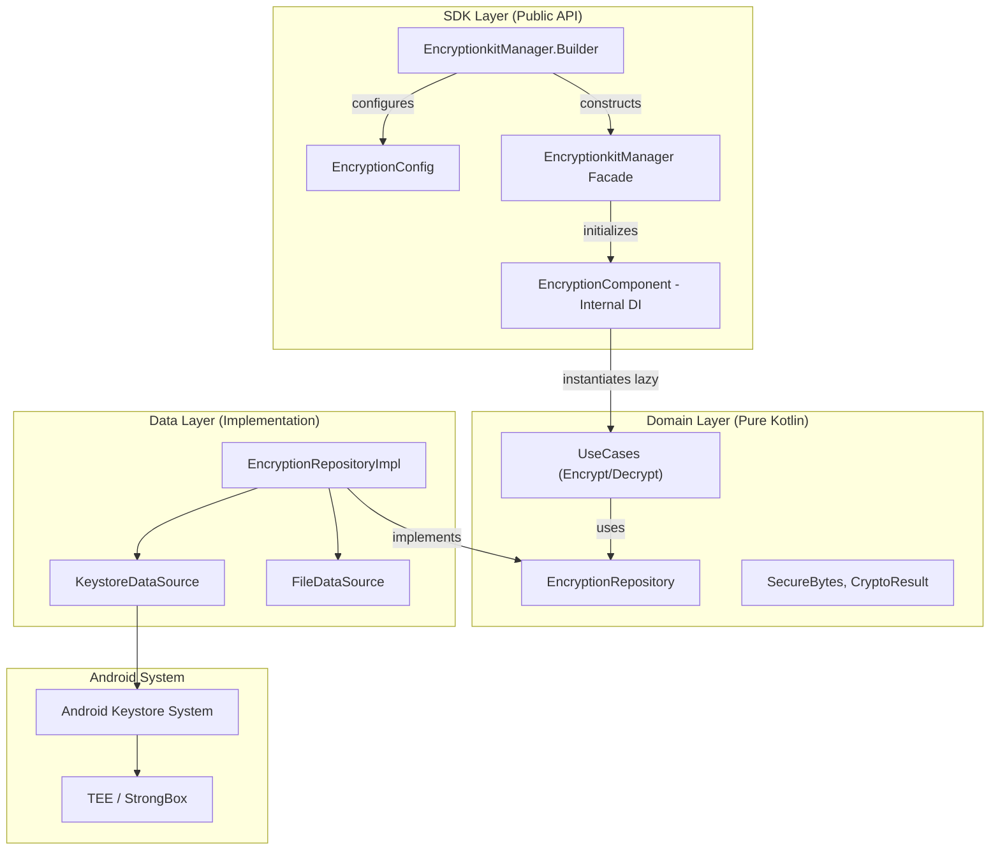

# Encryptionkit for Android 🛡️

**"Military-grade privacy for your app's data."**

Encryptionkit is a high-performance, security-focused library for Android designed to provide a robust abstraction layer over the **Android Keystore System** and **Java Cryptography Architecture (JCA)**. It enforces modern cryptographic standards and hardware-backed security to protect sensitive information at rest and in transit.

## 🚀 Key Features

- **Hardware-Backed Security**: Seamless integration with **TEE (Trusted Execution Environment)** and **StrongBox** to ensure keys never leave the secure hardware.
- **Authenticated Encryption**: Uses **AES-GCM (256-bit)** by default to ensure both data confidentiality and integrity (AEAD).
- **Zero-Trust Memory**: Optimized handling of sensitive data using **`SecureBytes`** to explicitly wipe data from memory after use.
- **Asymmetric Encryption**: Support for **RSA-OAEP (SHA-256)** with optional **Public Key Pinning** to prevent Man-in-the-Middle attacks.
- **Integrity & Hashing**: Secure one-way hashing (**SHA-256**, **MD5**) for data integrity verification and fingerprinting.
- **Clean Architecture & Zero-DI**: Decoupled design following Clean Architecture with an **Internal Dependency Graph** pattern, ensuring a zero-dependency footprint (no Dagger, Hilt, or Koin needed).

## 🏗 Architecture

Encryptionkit follows a strict **Clean Architecture** to ensure that cryptographic logic is isolated, testable, and secure. It implements an internal dependency graph for pure Kotlin dependency injection.



## 🛠 Usage Example

### 1. Initialize
Initialize the library using the Builder DSL.

```kotlin
val config = EncryptionConfig.build {
    alias = "my_app_secure_key"
    useStrongBox = true // Prefer Secure Element
    requireUserAuth = false
}

val encryptionManager = EncryptionkitManager.Builder().build(config)
```

### 2. Encrypt Sensitive Data (Securely)
Use `SecureBytes` to ensure sensitive data is wiped from memory. Operations are asynchronous (suspend functions).

```kotlin
val sensitiveData = "Top Secret".toByteArray()
val secureBytes = SecureBytes(sensitiveData)

val result = encryptionManager.encrypt(secureBytes)
result.onSuccess { cryptoResult ->
    // cryptoResult contains ciphertext and IV
}.onFailure { error ->
    // Handle error (e.g., CryptoException)
}

// IMPORTANT: Wipe memory after use
secureBytes.close()
```

### 3. Decrypt
Retrieve the original information using the stored ciphertext and IV.

```kotlin
val result = encryptionManager.decrypt(ciphertext, iv)
result.onSuccess { decryptedBytes ->
    val originalString = String(decryptedBytes)
}
```

### 4. Asymmetric Encryption (RSA) with Pinning
Encrypt data for a backend server using its public key.

```kotlin
val config = EncryptionConfig.build {
    certificatePathProvider = MyCertProvider()
    setPublicKeyPinning("a1b2c3d4...") // Fingerprint validation
}
val manager = EncryptionkitManager.Builder().build(config)

val result = manager.encryptWithPublicKey(payload)
```

### 5. Hashing
Generate a secure fingerprint of data (SHA-256 by default).

```kotlin
val hashResult = encryptionManager.hashToHex("Important Data")
// e.g., "5e884898da28047151d0e56f8dc6292773603d0d6aabbdd62a11ef721d1542d8"
```

### 6. Security Management
Verify the hardware security level or delete the key.

```kotlin
// Check Security Level (STRONGBOX, TRUSTED_ENVIRONMENT, or SOFTWARE)
val level = encryptionManager.getSecurityLevel()

// Delete Key
encryptionManager.deleteKey()
```

## 📂 Project Structure

- `:library` (`es.joshluq.encryptionkit`)
    - `sdk`: Public API Facade, Configuration, and Internal DI.
    - `domain`: Pure Kotlin business logic (`model`, `usecase`, `repository`, `provider`).
    - `data`: Android-specific implementations (`datasource`, `repository impl`).
- `:showcase`: A sample app demonstrating all features, including TEE verification and secure memory usage.

## 🧪 Quality Assurance

- **Compliance**: Strictly follows **NIST** and **Android Security** best practices.
- **Internal DI Graph**: Zero-dependency footprint using pure Kotlin lazy instantiation.
- **Testing**: Comprehensive suite of unit tests for all layers, including Keystore hardware simulation.

---

*Developed with a security-first mindset.*
