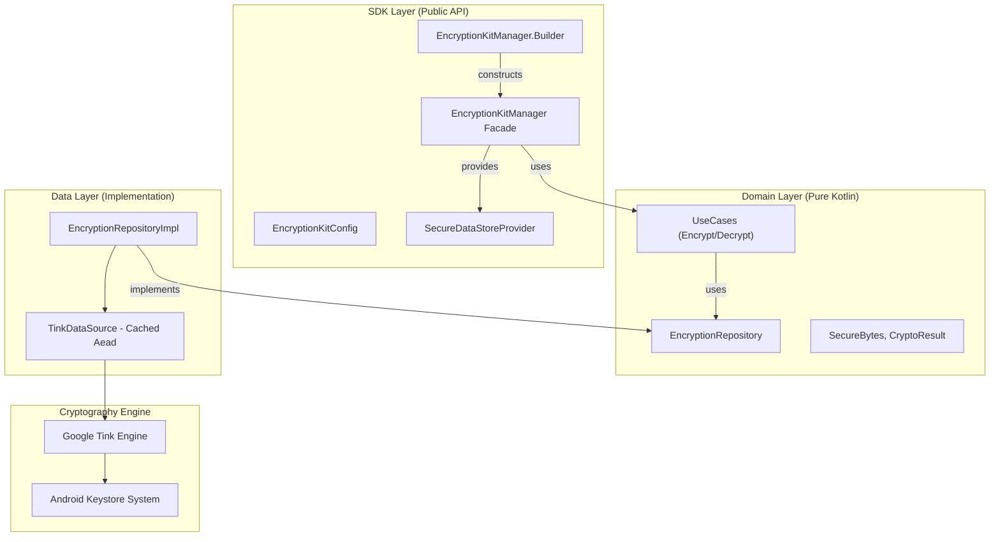

# EncryptionKit for Android 🛡️

**"High-assurance cryptography for modern Android applications."**

EncryptionKit is a robust abstraction layer built on top of **Google Tink** and the **Android Keystore System**. It simplifies complex cryptographic operations by providing a secure-by-default API, enforcing modern standards like **AEAD**, and offering seamless integration with **Jetpack DataStore** for encrypted persistence.

## 🚀 Key Features

- **Google Tink Core**: Leverages Google's battle-tested cryptographic library to eliminate common implementation errors (IV misuse, padding oracles).
- **Hardware-Backed Security**: Direct integration with **TEE (Trusted Execution Environment)** and **StrongBox** for hardware-protected keys.
- **Secure Storage**: Built-in **`SecureDataStoreProvider`** implementing the `StorageProvider` interface from FoundationKit for encrypted persistence.
- **Authenticated Encryption (AEAD)**: Uses **AES-GCM (256-bit)** to ensure confidentiality and data integrity.
- **Metadata Binding (AD)**: Support for **Associated Data** to cryptographically bind ciphertexts to their context (e.g., preference keys).
- **Zero-Trust Memory**: Native support for **`SecureBytes`** to ensure sensitive data is wiped from RAM immediately after use.
- **Asymmetric Encryption**: Modern **RSA-OAEP (SHA-256)** implementation with public key pinning support.
- **Internal Dependency Graph**: Zero-dependency footprint (no Dagger/Hilt/Koin) for a lightweight SDK.

## 🏗 Architecture

EncryptionKit follows **Clean Architecture** principles. The encryption logic is encapsulated in a dedicated `TinkDataSource` with an internal cache for high performance.



## 🛠 Usage Example

### 1. Initialize
Initialize the SDK using the simplified DSL entry point.

```kotlin
val encryptionManager = EncryptionKitManager.build(context) {
    alias = "my_app_secure_key"
    publicKeyHash = "a1b2c3d4..." // Optional for pinning
}
```

### 2. Encrypt & Decrypt (Symmetric)
Tink manages the IV and integrity tags automatically. You can optionally provide `associatedData` to bind the encryption to a specific context.

```kotlin
val secureBytes = SecureBytes("Sensitive Data".toByteArray())

// Encrypt
val result = encryptionManager.encrypt(secureBytes, associatedData = "user_id_123".toByteArray())
result.onSuccess { cryptoResult ->
    val encryptedData = cryptoResult.ciphertext
}

// Decrypt
val decrypted = encryptionManager.decrypt(encryptedData, associatedData = "user_id_123".toByteArray())
```

### 3. Secure Storage (Jetpack DataStore)
Easily create an encrypted storage provider that integrates with FoundationKit's `StorageProvider`.

```kotlin
val secureStorage = encryptionManager.createSecureStorage(
    dataStore = context.dataStore,
    serializerProvider = MyGsonSerializer()
)

// The data is automatically encrypted with Tink and bound to its key
secureStorage.save("api_token", "eyJhbGciOiJI...")

// Read it back safely
val token: String? = secureStorage.read("api_token")
```

### 4. Hashing
Secure one-way fingerprinting.

```kotlin
val hashHex = encryptionManager.hashToHex("Fingerprint me")
```

## 📂 Project Structure

- `:library` (`es.joshluq.encryptionkit`)
    - `sdk`: Public API, Configuration, and Internal DI.
    - `data`: Tink implementation, `TinkDataSource` (cached), and `SecureDataStoreProvider`.
    - `domain`: Pure business logic, UseCases, and Repository interfaces.
- `:showcase`: A sample app demonstrating Secure Storage, hardware security verification, and AEAD encryption.

## 🧪 Quality Assurance

- **Tink Standard**: Inherits the security guarantees of Google's Tink library.
- **Performance**: Internal caching of `Aead` primitives to minimize Keystore access latency.
- **Memory Safety**: Explicit wiping of sensitive data via the `SecureBytes` lifecycle.

---

*Developed with a security-first mindset.*
