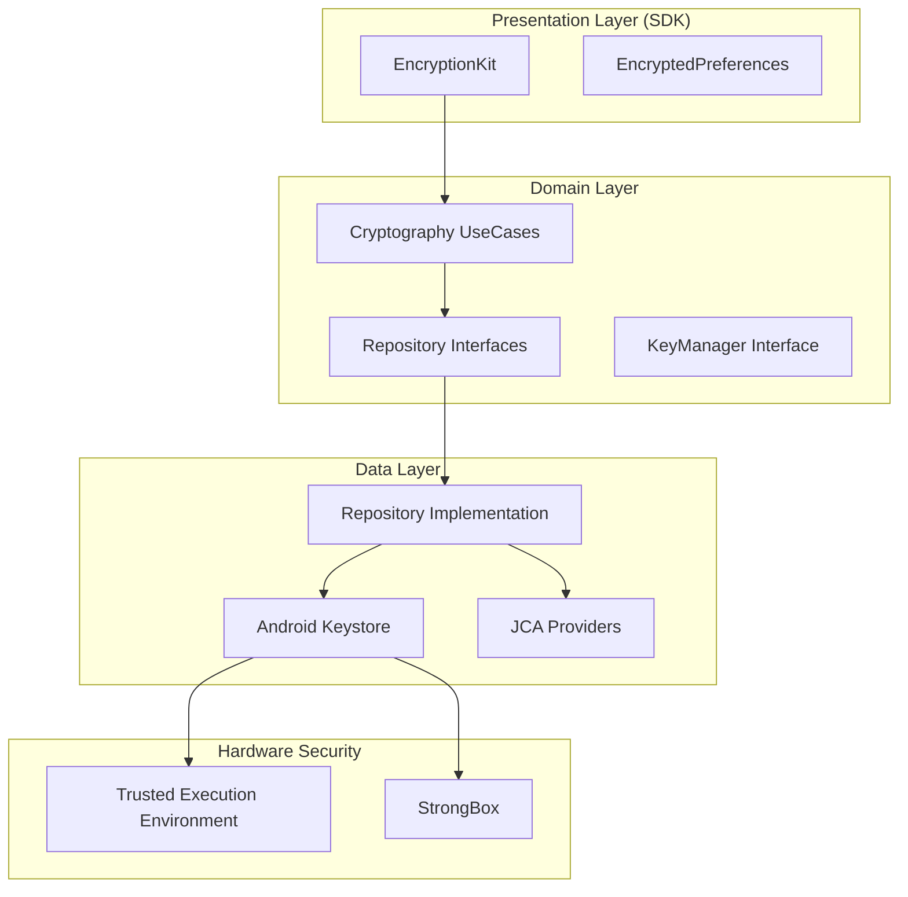

# Encryptionkit for Android 🛡️

**"Military-grade privacy for your app's data."**

Encryptionkit is a high-performance, security-focused library for Android designed to provide a robust abstraction layer over the **Android Keystore System** and **Java Cryptography Architecture (JCA)**. It enforces modern cryptographic standards and hardware-backed security to protect sensitive information at rest and in transit.

## 🚀 Key Features

- **Hardware-Backed Security**: Seamless integration with **TEE (Trusted Execution Environment)** and **StrongBox** to ensure keys never leave the secure hardware.
- **Authenticated Encryption**: Uses **AES-GCM (256-bit)** by default to ensure both data confidentiality and integrity (AEAD).
- **Advanced Key Management**: Automatic generation, storage, and rotation of keys within the Android Keystore with restricted purposes.
- **Biometric Integration**: Built-in support for `BiometricPrompt` to protect key usage with mandatory user authentication.
- **Asymmetric Cryptography**: Support for **RSA-OAEP** for secure key wrapping and **ECDSA** for modern digital signatures.
- **Secure Storage Wrappers**: Transparent protection for `SharedPreferences` and database fields.
- **Zero-Trust Memory**: Optimized handling of sensitive data using `ByteArray` and `CharArray` for explicit memory clearing.

## 🏗 Architecture

Encryptionkit is built using **Clean Architecture** to ensure that cryptographic logic is isolated, testable, and strictly follows security contracts.



## 🛠 Usage Example

### 1. Initialize and Configure
Initialize the library specifying the security level and the key alias.

```kotlin
val encryptionKit = EncryptionKit.builder(context)
    .setAlias("my_app_secret_key")
    .useStrongBox(true) // Preference for StrongBox (Secure Element) if available
    .setRequireUserAuthentication(true) // Bind key usage to biometrics
    .build()
```

### 2. Encrypt Sensitive Data
Protect data using authenticated encryption (AES-GCM).

```kotlin
val secretData = "Sensitive Information".toByteArray()
val encryptedData = encryptionKit.encrypt(secretData)

// The result contains both the ciphertext and the required IV
```

### 3. Decrypt and Access
Retrieve the original information securely.

```kotlin
try {
    val decryptedData = encryptionKit.decrypt(encryptedData)
    val originalString = String(decryptedData)
} catch (e: CryptoException) {
    // Handle decryption errors (e.g., tampering or auth failure)
}
```

## 📂 Project Structure

- `:library`: The core cryptographic engine (named `:encryptionkit`).
    - `domain`: Cryptographic abstractions, security contracts, and UseCases.
    - `data`: Implementation using Android Keystore, StrongBox integration, and JCA.
- `:showcase`: A sample app demonstrating hardware-backed encryption, biometric prompts, and secure storage implementation.

## 🧪 Quality Assurance

- **Compliance**: Strictly follows **NIST** and **Android Security** best practices.
- **KDocs**: 100% complete API documentation.
- **Testing**: Comprehensive suite of unit tests for cryptographic logic and instrumented tests (AndroidTests) for Keystore validation across different API levels.
- **Security Audits**: Isolated code paths designed for easy auditing and zero-trust memory management.

---

*Developed with a security-first mindset.*
