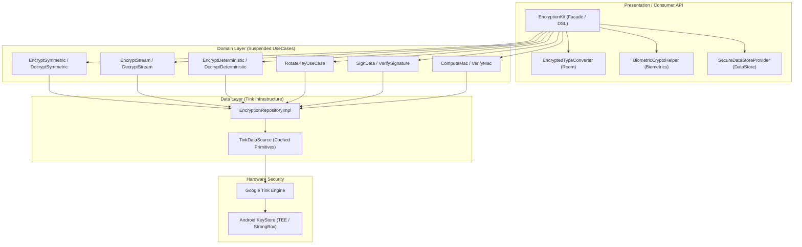

# EncryptionKit for Android 🛡️

**"High-assurance, zero-trust cryptography for modern Android applications."**

EncryptionKit is an enterprise-grade cryptographic SDK built on top of **Google Tink** and the **Android Keystore System**. It provides a secure-by-default, misuse-resistant API following **Clean Architecture** and **Zero-DI** (no Dagger, Hilt, or external dependency injection frameworks).

---

## 🚀 Key Capabilities

- **Google Tink Core**: Eliminates common cryptographic pitfalls (IV/nonce reuse, padding oracles) via Google's audited primitives.
- **Hardware-Backed Security**: Hardware-isolated keys protected by **TEE (Trusted Execution Environment)** and **StrongBox Keymaster**.
- **Large File Streaming (`StreamingAead`)**: Encrypts and decrypts multi-gigabyte files (videos, photos, databases) in 4 KB authenticated chunks to prevent `OutOfMemoryError`.
- **Searchable Encryption (`DeterministicAead`)**: AES256-SIV (RFC 5297) for searchable fields and exact database queries (`SELECT WHERE email = ?`).
- **Room Database Integration**: Built-in `@ProvidedTypeConverter` helpers (`EncryptedStringConverter` and `EncryptedByteArrayConverter`) for transparent column-level encryption.
- **Transparent Key Rotation**: Rotates primary encryption keys seamlessly without invalidating or requiring immediate re-encryption of historic data.
- **Asymmetric Digital Signatures**: ECDSA (NIST P-256 with SHA-256) for non-repudiation and origin verification.
- **Message Authentication Codes (MAC)**: HMAC-SHA256 (256-bit tag) with constant-time verification against timing attacks.
- **Biometric Hardware Lock (`BiometricCryptoHelper`)**: Keys tied to Android Keystore user authentication and integrated with `androidx.biometric.BiometricPrompt`.
- **Encrypted DataStore**: Built-in `SecureDataStoreProvider` with cryptographically bound metadata (Associated Data).
- **Zero-Trust Memory Safety**: Native `SecureBytes` wrapping with immediate memory zeroing upon `.close()`.

---

## 📦 Installation

Add the dependency to your app or library module `build.gradle.kts`:

```kotlin
dependencies {
    implementation("es.joshluq.kit:encryptionkit:<version>")

    // Optional: Only if using Room Database TypeConverters
    compileOnly("androidx.room:room-common:2.6.1")

    // Optional: Only if using Biometric Hardware Authentication
    implementation("androidx.biometric:biometric:1.1.0")
}
```

---

## 🏗 Architecture & Design Principles

EncryptionKit enforces strict **Clean Architecture** and a **Zero-Dependency DI Graph**:


```mermaid
graph TD
    subgraph Presentation ["Presentation / Consumer API"]
        EK["EncryptionKit (Facade / DSL)"]
        Room["EncryptedTypeConverter (Room)"]
        Bio["BiometricCryptoHelper (Biometrics)"]
        DS["SecureDataStoreProvider (DataStore)"]
    end

    subgraph Domain ["Domain Layer (Suspended UseCases)"]
        StreamUC["EncryptStream / DecryptStream"]
        DaeadUC["EncryptDeterministic / DecryptDeterministic"]
        RotateUC["RotateKeyUseCase"]
        SignUC["SignData / VerifySignature"]
        MacUC["ComputeMac / VerifyMac"]
        SymmUC["EncryptSymmetric / DecryptSymmetric"]
    end

    subgraph Data ["Data Layer (Tink Infrastructure)"]
        Repo["EncryptionRepositoryImpl"]
        TDS["TinkDataSource (Cached Primitives)"]
    end

    subgraph Hardware ["Hardware Security"]
        Tink["Google Tink Engine"]
        Keystore["Android KeyStore (TEE / StrongBox)"]
    end

    EK --> SymmUC & StreamUC & DaeadUC & RotateUC & SignUC & MacUC
    EK --> Room & Bio & DS
    SymmUC & StreamUC & DaeadUC & RotateUC & SignUC & MacUC --> Repo
    Repo --> TDS
    TDS --> Tink --> Keystore
```

---

## 🛠 Usage Guide

### 1. Initialization
Initialize `EncryptionKit` using the DSL builder. Always pass your application context.

```kotlin
val encryptionKit = EncryptionKit.build(context) {
    alias = "my_app_secure_alias"
    publicKeyHash = "a1b2c3d4..." // Optional: for asymmetric RSA certificate pinning
}
```

---

### 2. Authenticated Symmetric Encryption (AEAD)
Standard encryption with **AES-GCM (256-bit)**. Context binding via `associatedData` prevents ciphertext splicing attacks. Sensitive payloads use `SecureBytes` for zero-trust memory wiping.

```kotlin
val sensitiveData = SecureBytes("My Confidential Payload".toByteArray())
val contextBinding = "user_account_12345".toByteArray()

// Encrypt
val result = encryptionKit.encrypt(sensitiveData, associatedData = contextBinding)
result.onSuccess { cryptoResult ->
    val ciphertext = cryptoResult.ciphertext
}

// Decrypt
val decryptedResult = encryptionKit.decrypt(ciphertext, associatedData = contextBinding)
decryptedResult.onSuccess { secureBytes ->
    secureBytes.use { bytes ->
        val text = String(bytes.data)
        // Memory is automatically zeroed out after this block!
    }
}
```

---

### 3. Streaming Large Files (`StreamingAead`)
Encrypts and decrypts large files (photos, videos, databases) using **AES256-GCM-HKDF-4KB**. Data is processed in streaming chunks without loading the whole file into RAM.

```kotlin
val sourceFile = File(context.filesDir, "large_video.mp4")
val encryptedFile = File(context.filesDir, "large_video.enc")

// Encrypt file
sourceFile.inputStream().use { inputStream ->
    encryptedFile.outputStream().use { outputStream ->
        encryptionKit.encryptStream(inputStream, outputStream).getOrThrow()
    }
}

// Decrypt file
val restoredFile = File(context.filesDir, "restored_video.mp4")
encryptedFile.inputStream().use { inputStream ->
    restoredFile.outputStream().use { outputStream ->
        encryptionKit.decryptStream(inputStream, outputStream).getOrThrow()
    }
}
```

---

### 4. Deterministic Encryption for Searchable DB Fields (`DeterministicAead`)
Standard AEAD produces random ciphertexts for identical plaintexts. For database fields that must be searchable (`SELECT * FROM users WHERE email = ?`), use deterministic **AES256-SIV** (RFC 5297):

```kotlin
val email = SecureBytes("alice@example.com".toByteArray())

val encryptedEmail = encryptionKit.encryptDeterministic(email).getOrThrow()

// Identical plaintext and associated data always generate the exact same ciphertext
val queryResult = userDao.findByEncryptedEmail(encryptedEmail.ciphertext)
```

---

### 5. Room Database Column Encryption (`TypeConverters`)
Encrypt entity columns transparently in Room databases using `@ProvidedTypeConverter`.

```kotlin
@Entity(tableName = "users")
data class UserEntity(
    @PrimaryKey val id: Long,
    val username: String,
    val sensitiveToken: String, // Encrypted in SQLite as Base64 ciphertext
    val biometricPayload: ByteArray? // Encrypted as BLOB
)

@Database(entities = [UserEntity::class], version = 1)
@TypeConverters(EncryptedStringConverter::class, EncryptedByteArrayConverter::class)
abstract class AppDatabase : RoomDatabase() {
    abstract fun userDao(): UserDao
}

// Build database providing converters initialized with EncryptionKit:
val database = Room.databaseBuilder(context, AppDatabase::class.java, "app.db")
    .addTypeConverter(encryptionKit.createEncryptedStringConverter())
    .addTypeConverter(encryptionKit.createEncryptedByteArrayConverter())
    .build()
```

> **Tip:** You can enable deterministic mode (`encryptionKit.createEncryptedStringConverter(deterministic = true)`) for fields you want to filter or query in SQL statements.

---

### 6. Transparent Key Rotation
Rotate the primary encryption key according to regulatory policies (e.g., PCI-DSS, HIPAA). The previous keys are kept in the Keyset for historic decryption, while new encryptions use the freshly generated key:

```kotlin
// Rotates the primary key for the alias
val rotationResult = encryptionKit.rotateKey()

rotationResult.onSuccess {
    // New data will be encrypted with Key v2.
    // Historic data encrypted with Key v1 can still be decrypted transparently!
}
```

---

### 7. Digital Signatures (`PublicKeySign` / `PublicKeyVerify`)
Ensure message origin authenticity and non-repudiation using **ECDSA (NIST P-256 with SHA-256)**:

```kotlin
val document = "Transaction Approved: \$500.00".toByteArray()

// Sign with private key
val signature = encryptionKit.sign(document).getOrThrow()

// Verify with public key
val isValid = encryptionKit.verifySignature(document, signature).getOrThrow()
if (isValid) {
    // Signature verified successfully
}
```

---

### 8. Message Authentication Codes (MAC / HMAC)
Verify data integrity and authenticity using **HMAC-SHA256 (256-bit tag)** with constant-time verification:

```kotlin
val payload = "payload_content".toByteArray()

// Compute MAC
val macTag = encryptionKit.computeMac(payload).getOrThrow()

// Verify MAC (timing attack safe)
val isAuthentic = encryptionKit.verifyMac(payload, macTag).getOrThrow()
```

---

### 9. Biometric Hardware Authentication (`BiometricCryptoHelper`)
Tie encryption/decryption keys to the device's biometric prompt (fingerprint or face unlock):

```kotlin
val biometricHelper = encryptionKit.createBiometricCryptoHelper()

// 1. Prepare CryptoObject for BiometricPrompt
val cryptoObject = biometricHelper.createEncryptCryptoObject(alias = "biometric_vault_key")

val promptInfo = BiometricPrompt.PromptInfo.Builder()
    .setTitle("Unlock Vault")
    .setNegativeButtonText("Cancel")
    .build()

// 2. Authenticate using AndroidX BiometricPrompt
val biometricPrompt = BiometricPrompt(activity, executor, object : BiometricPrompt.AuthenticationCallback() {
    override fun onAuthenticationSucceeded(result: BiometricPrompt.AuthenticationResult) {
        val authenticatedCryptoObject = result.cryptoObject ?: return
        
        // 3. Encrypt immediately using the hardware-unlocked cipher
        val secureSecret = SecureBytes("My Banking PIN".toByteArray())
        val cryptoResult = biometricHelper.encrypt(authenticatedCryptoObject, secureSecret)
        
        // Store ciphertext and IV safely
        val ciphertext = cryptoResult.ciphertext
        val iv = cryptoResult.iv
    }
})

biometricPrompt.authenticate(promptInfo, cryptoObject)
```

---

### 10. Encrypted Key-Value Persistence (Jetpack DataStore)
Persist sensitive settings or tokens into Jetpack DataStore with automatic AEAD encryption and key binding:

```kotlin
val secureStorage = encryptionKit.createSecureStorage(
    dataStore = context.dataStore,
    serializerProvider = MyGsonSerializer()
)

// Save: automatically encrypted and bound to preference key
secureStorage.save("session_token", "eyJhbGciOiJI...")

// Read back safely
val token: String? = secureStorage.read("session_token")
```

---

## 🔒 Security Best Practices

1. **Never Log Sensitive Payloads**: EncryptionKit uses lazy lambda logging (`LoggerKit.d { ... }`) to ensure no string allocations or sensitive plaintexts are exposed.
2. **Always Close `SecureBytes`**: Wrap plaintext payloads in `.use { }` to guarantee that memory is wiped with zeroes immediately after encryption or decryption.
3. **Bind Context with Associated Data**: Whenever persisting encrypted data (e.g., in DataStore or Room), provide the record ID or preference key as `associatedData`.
4. **Unit Test Isolation**: In JUnit JVM unit tests, mock `TinkDataSource` or `EncryptionRepository` to avoid hardware Android Keystore dependencies.

---

## 📄 License

*Developed with a security-first, high-assurance mindset.*
